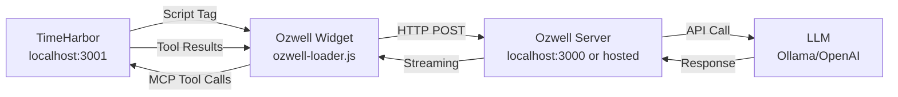

# Ozwell AI Assistant Integration

This guide explains how to integrate the Ozwell AI chat widget into TimeHarbor.

---

## Prerequisites

You need an Ozwell endpoint URL. This can be either:

**Option 1: Local Development**
- Ozwell reference server running at `http://localhost:3000`
- (See Ozwell reference server repo for setup instructions)

**Option 2: Hosted Ozwell (Recommended)**
- Production URL: `https://ozwell.timeharbor.com` *(URL coming soon)*
- Contact your team admin for the endpoint URL

---

## Quick Start

**Time required:** ~2 minutes

1. **Configure the endpoint** in `/public/ozwell-config.js`:
   ```javascript
   window.OzwellChatConfig = {
     widgetUrl: 'https://ozwell.timeharbor.com/embed/ozwell.html', // Or http://localhost:3000/embed/ozwell.html
     endpoint: 'https://ozwell.timeharbor.com/embed/chat',          // Or http://localhost:3000/embed/chat
     model: 'llama3.1:8b',
     // ... rest of config
   };
   ```

2. **Start TimeHarbor**:
   ```bash
   meteor --port 3001
   ```

3. **Test the widget**:
   - Login to TimeHarbor
   - Look for chat button (bottom-right corner)
   - Click to open chat
   - Try: `suggest some ticket titles`

---

## Architecture



**Key Points:**
- TimeHarbor loads Ozwell via script tag (iframe-sync bundled, no separate import needed)
- MCP tools run in TimeHarbor, controlled by postMessage
- All AI processing happens on Ozwell server (local or hosted)

---

## Available MCP Tools

The AI has access to these tools when chatting:

| Tool | Purpose | Example Usage |
|------|---------|---------------|
| `get_project_history` | Retrieves recent tickets from current project | "suggest some ticket titles" |
| `get_project_time_stats` | Calculates total time spent on project | "how much time have I spent?" |
| `get_current_ticket_form` | Reads current form field values | "what's filled in right now?" |
| `update_ticket_title` | Auto-fills the title field | "set title to Fix login bug" |
| `update_ticket_description` | Auto-fills description field | "add description: Fixed auth issue" |
| `update_ticket_time` | Sets hours/minutes/seconds | "set time to 2 hours 30 minutes" |
| `get_conversation_history` | Retrieves past conversations | *(currently unused)* |

**How it works:**
1. User asks a question
2. AI decides which tool(s) to call
3. Widget sends tool call to TimeHarbor via postMessage
4. TimeHarbor executes tool, returns result
5. AI uses result to respond

---

## Configuration

### System Prompt

Edit `/public/ozwell-config.js` to customize AI behavior:

```javascript
window.OzwellChatConfig = {
  system: `Your custom instructions here...`,
  // ...
};
```

The system prompt defines:
- How AI should use tools (READ vs UPDATE)
- When to call get_project_history
- Context reset rules
- Tool usage examples

### Widget Appearance

```javascript
window.OzwellChatConfig = {
  welcomeMessage: 'Hi! I can help you track time...',
  title: 'TimeHarbor Assistant',
  placeholder: 'Ask about your tickets...',
  // ...
};
```

### Model Selection

```javascript
window.OzwellChatConfig = {
  model: 'llama3.1:8b',  // Must be available on Ozwell server
  // ...
};
```

---

## Optional Features

### Real-Time Form Sync

**Status:** Currently disabled (works fine without it)

Syncs form changes to AI in real-time for proactive suggestions.

**To enable:** Uncomment code block in `/public/ozwell-mcp-tools.js` (~line 550)

**Uses:** `OzwellChat.updateContext()` API (bundled in ozwell-loader.js)

**Example:** AI says "I see you're working on auth issues, want related tickets?" as you type

---

## Adding Custom Tools

Want to add custom functionality? Here's how:

**1. Define tool in `/public/ozwell-mcp-tools.js`:**
```javascript
{
  type: 'function',
  function: {
    name: 'get_ticket_count',
    description: 'Counts total tickets in current project',
    parameters: {
      type: 'object',
      properties: {},
      required: []
    }
  }
}
```

**2. Add handler in same file:**
```javascript
const toolHandlers = {
  get_ticket_count: async (params) => {
    const teamId = document.querySelector('select[name="team"]')?.value;

    const count = await new Promise((resolve, reject) => {
      Meteor.call('getTicketCount', { teamId }, (error, result) => {
        if (error) reject(error);
        else resolve(result);
      });
    });

    return { success: true, count };
  }
};
```

**3. Add server method in `/server/methods/ozwell.js`:**
```javascript
async getTicketCount({ teamId }) {
  check(teamId, String);
  if (!this.userId) throw new Meteor.Error('not-authorized');

  return await Tickets.find({ teamId }).countAsync();
}
```

That's it! The AI can now use your custom tool.

---

## File Reference

### Configuration
- `/public/ozwell-config.js` - Widget config (system prompt, model, endpoints)

### Client-Side
- `/public/chat-wrapper.js` - Widget UI and drag behavior
- `/public/chat-wrapper.css` - Widget styles
- `/public/ozwell-mcp-tools.js` - MCP tool definitions and handlers
- `/client/main.html` - Loads Ozwell scripts

### Server-Side
- `/server/methods/ozwell.js` - Meteor server methods for MCP tools
- `/server/main.js` - Registers ozwellMethods

### External (Ozwell Server)
- `http://localhost:3000/embed/ozwell-loader.js` - Main widget loader
- `http://localhost:3000/embed/ozwell.html` - Widget iframe

---

## Troubleshooting

**Chat widget not appearing?**
- Check Ozwell server is running: `curl http://localhost:3000` (for local)
- Verify browser console for errors (F12 → Console)
- Check `/public/ozwell-config.js` has correct endpoint URLs

**AI not calling tools?**
- Open browser console and look for tool call logs: `[MCP Tools] Tool call requested`
- Verify system prompt is loaded: `window.OzwellChatConfig.system`
- Check Ozwell server logs for errors

**Tools returning errors?**
- Check browser console for specific error messages
- Verify Meteor methods exist in `/server/methods/ozwell.js`
- Test Meteor method directly in browser console: `Meteor.call('getProjectHistory', ...)`

**Widget styling broken?**
- Verify `/public/chat-wrapper.css` loaded (check Network tab)
- Check for CSS conflicts with TimeHarbor styles

---

## Next Steps

After setup works:
1. Try different queries to see tool capabilities
2. Check browser console to see which tools get called
3. Customize system prompt in `/public/ozwell-config.js` if needed
4. Add your own tools using the example above
5. (Optional) Enable real-time form sync for proactive suggestions

For issues or questions, create an issue in the TimeHarbor repository.
